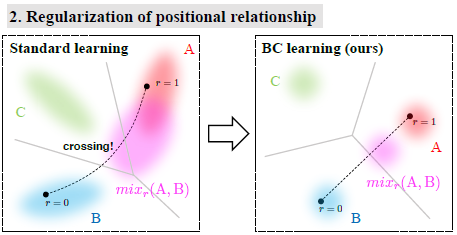

# Between-class Learning for Image Classification

## 甲斐コメント

Mixupの亜種みたいなもの（互いに引用していない…）。

Mixupより丁寧に合成方法を検討している点、KLダイバージェンスを取り入れている点など、どちらかというとこちらの方が丁寧な印象。論文の書き方もこっちの方が面白い。

結論としては似たようなもので、N=2のときが一番良いみたい。

## Abstruct

クラス間学習（BC学習）と呼ばれる画像分類のための新しい学習法
- 異なるクラスに属する2つの画像をランダムな比率で混合してクラス間画像を生成
  - 内部分割を使用した単純な混合方法：性能を大幅に向上
  - 画像を波形として扱う混合方法を提案：性能がさらに向上
- 混合画像をモデルに入力し、混合比を出力するようにモデルを訓練
- 特徴分布の形状に制約を課す能力を有するため汎化性能が改善される

BC学習はもともと音のために開発された方法だが、CNNは入力データを波形として扱うという側面を持っているので、上手くいく。

## 1 Introduction

目的：さらなる改善のために新規のアプローチが必要

クラス間学習（BC学習）

- 2クラス間の混合比を予測する問題を解決することによって分類問題を学習、音声認識で実績
- トレーニングデータのバリエーションの増加
- 特徴分布に制約を課す→敵対化能力が改善される

BC学習が画像に対してもうまく機能するか（入力データのモダリティに関係なく使用することができるか）

- 人間の視覚的には意味がない

  

- CNNを使う場合、2つの波形の混合と捉えられるため、意味がある

画像のBC学習を2通り検討する

- 内部分割を用いた最も簡単な混合方法

- 画像を波形データ（BC+）として扱う改良された混合方法：

  "各画像から画像ごとの平均値を引きます。 こうすることで、各画像を音に似たゼロ平均波形として扱うことができます。 次に、画像エネルギーを画像あたりの標準偏差として定義し、画像エネルギーを考慮して2つの画像を混合します。"

Contribution

- 画像分類ネットワークの性能改善
- 特徴分布に制約を課す

## 2. 音の混合に関する先行研究 

詳細：https://openreview.net/forum?id=B1Gi6LeRZ. が出展

#### 2.1 概要

通常の分類問題

- 単一の学習例
- one-hotラベルに近づけるようトレーニング
- クロスエントロピー

BC学習

- 異なるクラスに属する2つのトレーニング例 → ランダムな比率
- 各クラスの混合比に近づけるようトレーニング
- モデルの出力と比率ラベルの間のKLダイバージェンス

#### 2.3 動作原理

仮定：混合音がモデルに入力されると、混合音の特徴は元の２つの音の特徴の内分点の近くに位置する

→ 次の2つの制約を課すことができる

- 2クラス間でのフィッシャー基準が拡大する（≒ クラス内の分散に対するクラス間の距離の比率の増加）

  ：重なり合う領域の混合例の混合比を出力できないことにLossを課すため

  

- 特徴的な分布間の位置関係の正則化

  ：2つのクラスの混合音が他のクラスの音に分類されることにLossを課すため

  

→ BC学習は特徴分布に制約を課す能力を持ち、汎化性能を向上させる

## 3. 画像への拡張

#### 3.1 単純な混合

#### 3.2 画像におけるBC学習の動作原理

CNNには入力データを波形として扱うという側面があるため合成は有効。（最近の研究で、CNNの各フィルタは特定の周波数領域に応答するよう学習することが示されている）

実際に混合してPCAを用いて可視化

- 2つの画像の混合が2つの特徴の内部分割点の近くの点に投影される

- 混合画像の特徴は2つのクラスに分散されている

  →クラスの特徴分布間の位置関係の正則化

  →特徴空間におけるフィッシャーの基準の拡大

  ​

#### 3.3 BC+：波としての画像データ

正規化：

- 全トレーニングデータから計算された平均と標準偏差を使用して、入力データを各チャンネルに対して正規化する。各画像データは、xi ＝μi + di として表される。μiは静的成分、diは波成分である。

- 入力データ

  

  波成分 r d1 + (1-r) d2 が性能の改善に寄与する。

  ２つの波形の静的成分が同じであると仮定することになるので、静的成分 r μ1 ＋ (1-r) μ2 は悪影響を及ぼす可能性がある。

  ​

静的成分の除去：

- per-image mean を引く（channel-wise meanではない）
- zero-mean wave form
  
- 入力データ

エネルギーの考慮：

- 音の合成 + 音圧データの代わりに標準偏差を用いたエネルギーの評価

- 入力データ

  

  ​

## 4. Experiments

#### 4.1 ImageNet-1K

デフォルトのデータ拡大スキームを適用し、2つの224×224画像を得て、 U(0,1) から選択されたランダムな比率で混合した。

- 100 ep以降では従来手法を上回った
- ただし収束が遅く、100 ep以前では従来手法を下回る

　　→初期は0または1に近い混合比を生成し、rの分布を徐々にflatに変更するようなScheduleも有効？

#### 4.2 CIFAR

- 様々なネットワークにおいて、単純なBC学習によって精度向上し、BC+ ではさらに向上

- データ拡張を使用するとより効果が大きくなる

  →クラス内分散が大きくなるため、だいたいのデータ拡張とは相性が良い

  ​

#### 4.3 Ablation analysis（要素1つだけを変化させて比較実験する手法）

- 混合画像の作成方法

  | 施策         | 効果   |
  | ---------- | ---- |
  | 画像毎の平均減算   | 〇    |
  | 平方根による除算   | 〇    |
  | 画像エネルギーの考慮 | 微妙   |

  →画像データを波形として扱うことが性能向上に寄与する

  →画像エネルギーの分散は音エネルギーの分散よりも小さい

  ​

- ラベルとロス

  | 施策                         | 効果   |
  | -------------------------- | ---- |
  | 単一のラベルとSoftmaxCrossEntropy | ×    |
  | マルチラベルとSigmoidCrossEntropy | 〇    |
  | 比率ラベルとKL損失                 | ◎    |

- 混合した画像のクラス数

  | 施策                               | 効果   |
  | -------------------------------- | ---- |
  | N=1（単一クラスの2画像を合成）                | 〇    |
  | N=1または2（単一クラスの2画像または別クラスの2画像を合成） | ◎    |
  | N=2（別クラスの2画像を合成）                 | ☆    |
  | N=3（別クラスの3画像を合成）                 | ◎    |

  →同クラスの画像を合成するだけでもそこそこ改善するが、別クラスになるよう制御した方が良い

  →3クラス以上を混在させることは、特徴分布に制約を効率的に与えることができない

- Mixする層

| 施策    | 効果   |
| ----- | ---- |
| 入力    | ☆    |
| pool1 | ☆    |
| pool2 | △    |
| pool3 | ×    |
| fc1   | △    |
| fc2   | 〇    |

→入力に近い層で混合すると性能が向上

→畳み込みの途中で混合する性能が悪化することもある

→出力に近い層で混合しても性能にあまり影響しない

#### 4.4 可視化による考察

- BC学習で得られた特徴は球状に分布し、クラス内分散が小さい
- 標準学習で得られた特徴は、決定境界の近くから遠くまで広く分布

→特徴分布に制約を課すことが分類性能改善の理由と推測

## 5.結論 

BC学習と呼ばれる画像分類のための新しい学習法を提案し、音に対する研究と同様のアイデアを適用した。

2つの画像を混合し、混合比を出力するように学習することによって、性能が大幅に向上した。

BC学習は特徴分布に制約を課すことができる単純で強力な方法であり、画像や音声だけでなく他のモダリティにも適用できる可能性がある。